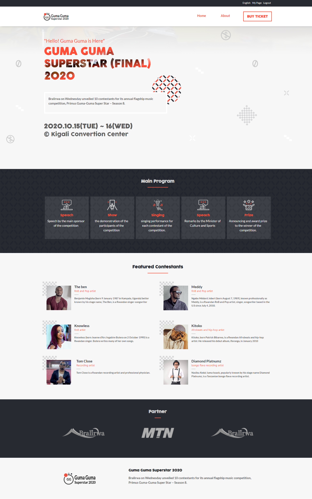

#

> This is an online website for buying tickets for a flagship music competition concert called Primus Guma Guma Superstar.
> 

## Built With

- HTML
- CSS3
- SASS
- Fontawesome
- ADOBE Illustrator

## Live Demo

[Live Demo Link](https://rukundoeric.github.io/Conference-page/)

## Getting Started

- Clone this repo https://github.com/rukundoeric/Conference-page/tree/conference-page
- Navigate to project directory.
- If you have liveserver in you vs-code, just run it.
- Ortherwise just open index page with your browser.

## Authors

👤 **Rukundo Eric**

- GitHub: [@githubhandle](https://github.com/rukundoeric)
- Twitter: [@twitterhandle](https://twitter.com/rukundoeric005)
- LinkedIn: [LinkedIn](https://www.linkedin.com/in/rukundo-eric-000bba181/)

## 🤝 Contributing

Contributions, issues, and feature requests are welcome!

Feel free to check the [issues page](https://github.com/rukundoeric/Conference-page/issues).

## Show your support

Give a ⭐️ if you like this project!

## Acknowledgments

- I would like to thank Cindy Shin for providing the sketch Design of this project.
- I would like to thank our code reviewer and anyone else who participated in making this done.

## 📝 License

This project is [MIT](./LICENCE) licensed.
